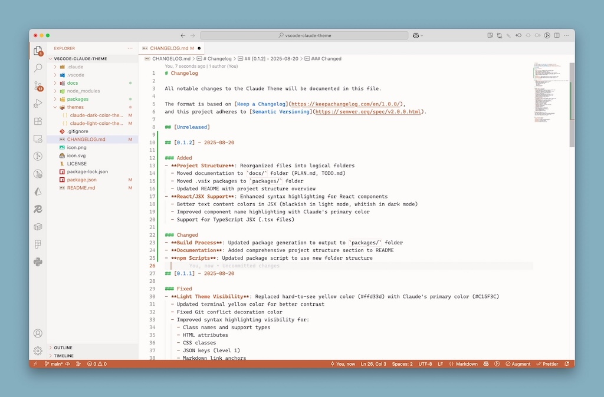
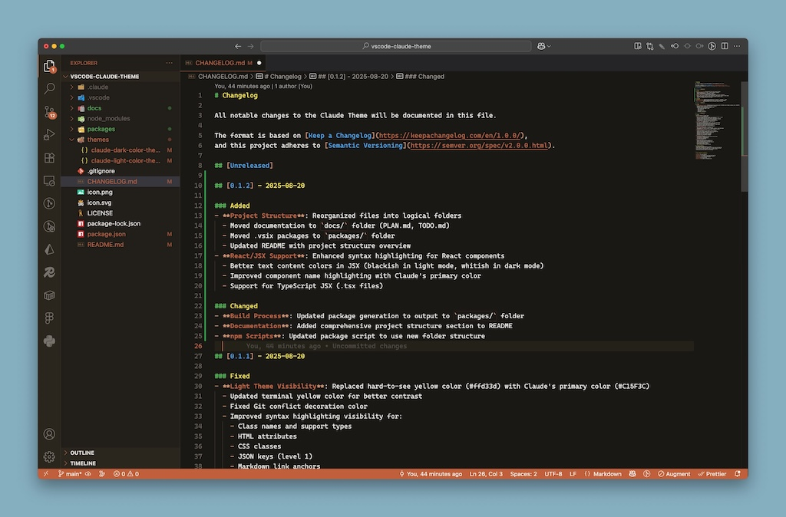

# Claude Theme for VS Code

A warm, professional VS Code theme inspired by Claude's design system, featuring both light and dark variants that capture Claude's approachable and elegant aesthetic.

## 🎨 Preview

### Claude Light



### Claude Dark



## ✨ Features

- **Two Variants**: Light and dark themes maintaining Claude's warm aesthetic
- **Warm Color Palette**: Based on Claude's signature rust-orange (#C15F3C) and complementary colors
- **Professional Design**: Clean, readable, and approachable interface
- **Serif Font Recommendations**: Optimized for Claude's preferred serif typography
- **Complete Coverage**: Syntax highlighting, UI elements, terminal, and Git integration
- **Accessibility**: Carefully chosen contrast ratios for excellent readability

## 🎯 Design Philosophy

Claude Theme embodies the same values as Claude itself:

- **Warmth**: Rust-orange accents create a welcoming coding environment
- **Professionalism**: Clean design suitable for both casual and corporate use
- **Approachability**: Soft edges and thoughtful color choices reduce visual fatigue
- **Intellectual Depth**: Sophisticated palette inspired by academic traditions

## 🚀 Installation

### From VS Code Marketplace

1. Open VS Code
2. Go to Extensions (Ctrl+Shift+X / Cmd+Shift+X)
3. Search for "Claude Theme"
4. Click Install
5. Select the theme: Ctrl+K Ctrl+T / Cmd+K Cmd+T → "Claude Light" or "Claude Dark"

### Manual Installation

1. Download the `.vsix` file from releases
2. Open VS Code
3. Press Ctrl+Shift+P / Cmd+Shift+P
4. Type "Extensions: Install from VSIX"
5. Select the downloaded file

## 🎨 Color Palette

### Primary Colors

- **Claude Orange**: `#C15F3C` - Primary accent and brand color
- **Dark Orange**: `#A14A2F` - Darker variant for emphasis

### Light Theme

- **Background**: `#faf9f5` - Warm off-white
- **Text**: `#2c2c2c` - Dark charcoal
- **Sidebar**: `#f5f4ed` - Light warm grey
- **Selection**: `#C15F3C30` - Transparent orange

### Dark Theme

- **Background**: `#1a1815` - Warm dark brown
- **Text**: `#e8e6e3` - Light warm grey
- **Sidebar**: `#201d18` - Medium dark brown
- **Selection**: `#C15F3C30` - Transparent orange

## 🔤 Recommended Fonts

Claude Theme is optimized for serif fonts that match Claude's typography philosophy:

```json
{
  "editor.fontFamily": "ui-serif, Georgia, Cambria, 'Times New Roman', Times, serif",
  "editor.fontSize": 14,
  "editor.fontWeight": "400"
}
```

### Premium Font Recommendations

- **Tiempos Text** - Klim Type Foundry
- **Styrene** - Commercial Type
- **Charter** - Bitstream (free alternative)
- **Source Serif Pro** - Adobe (free alternative)

## ⚙️ Configuration

Add these settings to your VS Code `settings.json` for the optimal Claude Theme experience:

```json
{
  "workbench.colorTheme": "Claude Light",
  "editor.fontFamily": "ui-serif, Georgia, Cambria, 'Times New Roman', Times, serif",
  "editor.fontSize": 14,
  "editor.lineHeight": 1.6,
  "editor.fontWeight": "400",
  "editor.cursorBlinking": "smooth",
  "editor.cursorSmoothCaretAnimation": "on",
  "workbench.tree.indent": 20,
  "workbench.tree.renderIndentGuides": "always"
}
```

## 🎯 Language Support

Claude Theme provides excellent syntax highlighting for:

- **Web Technologies**: HTML, CSS, JavaScript, TypeScript, React, Vue, Angular
- **Backend**: Python, Java, C#, PHP, Ruby, Go, Rust
- **Data**: JSON, YAML, XML, SQL
- **Markup**: Markdown, reStructuredText
- **Configuration**: Docker, TOML, INI
- **And many more!**

## 🤝 Contributing

Contributions are welcome! Please feel free to:

1. **Report Issues**: Found a color that doesn't look right? Let us know!
2. **Suggest Improvements**: Ideas for better syntax highlighting or UI colors
3. **Add Language Support**: Help improve syntax highlighting for specific languages
4. **Documentation**: Help improve this README or add screenshots

## 📄 License

MIT License - see [LICENSE](LICENSE) file for details.

## 🙏 Acknowledgments

- Inspired by [Claude](https://claude.ai) by Anthropic
- Design philosophy based on Claude's warm, professional aesthetic
- Color palette derived from Claude's brand guidelines
- Typography recommendations following Claude's serif font preferences

## 📞 Support

- **Issues**: [GitHub Issues](https://github.com/jnahian/vscode-claude-theme/issues)
- **Discussions**: [GitHub Discussions](https://github.com/jnahian/vscode-claude-theme/discussions)

---

_"Code with warmth and professionalism."_ - Claude Theme
